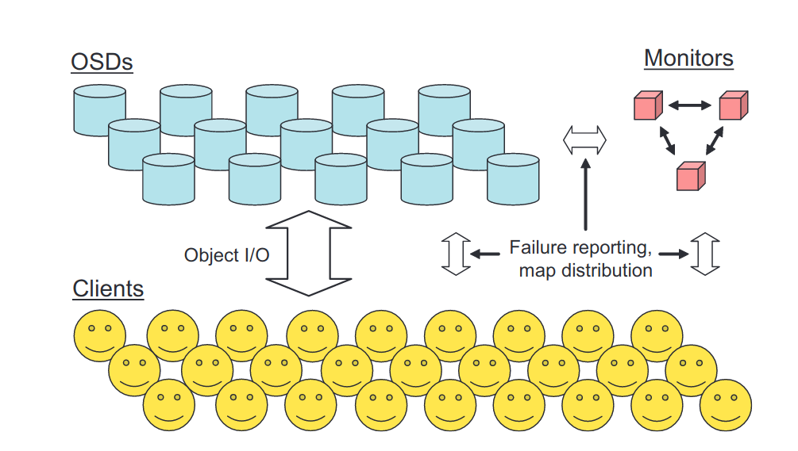
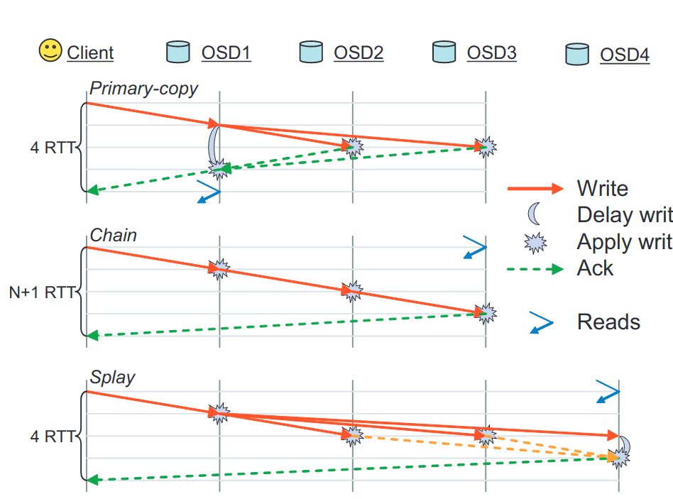

## 1. 简介

### 1.1 背景

高性能存储的要求较高（高吞吐量，低延时和对存储的抽象）块和对象存储被用作提高存储系统可扩展性的方式，但现有（论文当时）的系统将存储节点视作被动设备，而忽略了它们的自主性和智能性（存储节点是一个完整的计算机，有计算能力）。

（现有的）新兴存储架构通过促进客户端直接访问数据来简化布局并消除 IO 瓶颈，OSD（对象存储设备）将廉价机器的 CPU、网络接口、缓存和底层硬盘结合，将基于块的存储接口替换为基于命名、可变长度对象的存储接口。但这种架构没有利用设备的智能：传统设备被动响应读取和写入命令。随着存储集群规模增大，数据分配、故障检测和恢复等给客户端、控制器、元数据目录节点带来越来越大的负担，限制了可扩展性。

而 PB 级规模上的存储系统必然是动态的：

- 它们是增量构建的
- 能够随新存储加入而扩充、随老设备退役而收缩
- 设备故障和恢复
- 大量数据创建和销毁

### 1.2 RADOS

论文提出了[RADOS](https://ceph.com/assets/pdfs/weil-rados-pdsw07.pdf) : 一种可扩展的，自主的分布式对象存储（a Reliable、Autonomic Distributed Object Store）。

RADOS 旨在利用设备的计算能力分散随着规模扩大带来的（控制节点的）负载，同时给应用程序提供单一逻辑对象存储的抽象。通过为存储节点提供系统中数据分布的完整信息，设备可以使用点对点协议进行半自主操作，以自我管理数据复制、一致且安全地处理更新、参与故障检测、响应设备故障和通过重新复制或迁移导致的数据分布变化。

论文的原型实现公开了一个对象接口，可以在其中读取或写入字节范围（类似文件）。数据对象以多种方式分布在多个 OSD 上来防止节点故障。但是 RADOS 的可扩展性不依赖于特定的对象接口或冗余策略。

## 2. 可扩展的集群管理

RADOS 系统由大量 OSD 集合和一小群负责管理 OSD 集群成员资格的监视器组成。每个 OSD 包括一个 CPU、一些易失性 RAM、一个网络接口和一个本地连接的磁盘驱动器或 RAID。监视器是独立的进程，需要少量的本地存储。

### 2.1 Cluster Map

存储集群的管理完全由监视器集群对**Cluster Map**的操作来进行。Map 信息包含了集群内拥有哪些 OSD，简洁地显示系统中所有数据在集群内设备的分布。每个存储节点以及这个集群的客户端都保存有这个 Map 的副本。由于 Map 保存了完整的数据分布，因此客户端能公开一个简单的接口，将整个集群视作一个单个逻辑对象存储。

每当发生使 Cluster Map 更改的事件（如 OSD 状态改变或其他影响数据布局的事件），Map 的 epoch 就会递增。epoch 相当于版本号，使得各个节点能对当前数据的分布达成一致。Map 的更新是增量的，以减小频繁更新带来的开销。大多数情况下，更新只表明一个或多个 OSD 已失败或已恢复。多个更新可以放在一起来描述相差多个 epoch 的 Map 的差异。

### 2.2 数据放置（Data Palcement）

RADOS 的数据分布策略是将其中对象伪随机地分配给设备。当新的存储加入时，现存数据的随即子部分迁移到新设备以恢复平衡。该策略比较稳健，使所有设备保持相似的负载。数据放置是一个两阶段过程：计算对象属于哪个 PG，将 PG 分配到具体的存储设备上。不需要大型或繁琐的集中分配表。

系统存储的每个对象首先被映射到 PG（_placement group_ ），然后以 PG 为单位被分布到不同的设备上。PG 的计算公式：

$$
pgid=(r,hash(o)\&m)
$$

其中， \(r\) 是期望的副本数量，\(o\)是对象名称，\(\&\)是位与符号，\(m=2^k-1\)是掩码。\(m\)将 PG 的数量限制为\(2^k-1\)，需要定期改变\(m\)来调整 PG 的总数，这步需要逐步完成，以限制 PG 在设备间的迁移。

PG 基于**Cluster Map**分配给 OSD。**Cluster Map** 将 PG 与 OSD 的有序列表对应，PG 的副本就存储在有序列表对应的 OSD 上。副本与 OSD 的对应上，RADOS 采用的是**CRUSH** 算法：CRUSH 的行为类似于哈希函数，将每个 PG 的副本伪随机分配到固定的位置；但是 CRUSH 是稳定的，当有设备加入或离开集群时，大多数 PG 的位置不会改变；CRUSH 只转移足够的数据以维持平衡分布。（CRUSH 将在后面的文章介绍）

论文中提到 RADOS 有控制 PG 分簇级别的方法（PG 在集群中散布程度），但并未指明，只是描述了参数\(\mu\)表示每个 OSD 上存储的 PG 数量，默认是 100PG/OSD。可以通过调整它来控制 PG 在集群中的散布情况（个人认为这不能算明确的分簇控制）。

### 2.3 设备状态（Device State）

**Cluster Map**包含了当前在线且`up`的所有 OSD 的网络地址，和`down`掉设备的标示。除了`up`和`down`，`in`标示 OSD 被映射和分配了 PG，`out`则表示设备空闲。

CRUSH 会将 PG 映射到\(r\)个 OSD，然后 RADOS 过滤掉已关闭的设备，为 PG 生成可用的 OSD 列表。如果列表为空，则当前 PG 数据不可用，并且等待处理的 IO 被阻塞。

| state      | 说明                                       |
| :--------- | :----------------------------------------- |
| up & in    | 处于正常工作模式                           |
| down & out | 故障                                       |
| down & in  | OSD 不可用，但 PG 尚未重新映射到另一个 OSD |
| up & out   | OSD 在线且空闲                             |

### 2.4 Map 传播（Map Propagation）

RADOS 的集群很大，简单的广播 **Clust Map**是不现实的。不过只有当两个不同的 OSD 通信时或客户端与 OSD 通信时，Map 的`epoch`差异才会大，并且它们必须就 IO 的特定 PG 的状态达成一致。因此 RADOS 采取的方式是将 Map 更新信息与现有的 OSD 间消息结合，延迟传播 Map 更新，从而有效的减小传播负担。

每个 OSD 维护 Map 的增量更新记录，用自己最新的`epoch`标记所有消息，并且也会观察每个 peer 的`epoch`。如果收到 peer 的消息，而且其中`epoch`比自己的旧，它就会分享必要的增量信息使对方同步。类似地，当联系被认为具有较旧`epoch`的 peer 时，会提前共享增量更新。为了故障检测而定期交换的心跳消息（[参见第 3.3 节](#33-故障检测failure-detection)）确保更新能够快速传播——在一个拥有 \(n\) 个 OSD 的集群中，传播时间为 \(\mathcal{O}(\log{n})\)。

当一个 OSD 首次启动时，它会通过发送 `OSDBoot` 消息通知一个 Monitor（[参见第 4 节](#4-monitor)），该消息包含其最新的`epoch`。Monitor 集群会将 OSD 的状态更改为`up`，并回复必要的增量更新，以使 OSD 完全同步。当新的 OSD 开始联系与它共享数据的 OSD（[参见第 3.4 节](#34-数据迁移和故障恢复data-migration-and-failure-recovery)）时，受其状态更改影响的设备集会了解相应的 Map 更新。由于启动的 OSD 还不确切知道其 peer 的 `epoch`，它会共享最近 30 秒的增量更新历史记录，以确保安全。

这种预先共享地图的策略比较保守：OSD 在联系 peer 时，除非确定对方已经收到更新，否则会一直共享更新，这会导致 OSD 收到相同更新的重复信息。不过，OSD 收到的重复信息数量受其 peer 数量限制，而 peer 数量又取决于它管理的 PG 数量\(\mu\)。实际情况中，重复信息的水平远低于理论预期。

## 3. 智能存储设备（INTELLIGENT STORAGE DEVICES）

Map 中具有数据的完整映射信息，使得 RADOS 能够将数据冗余、故障检测和恢复的管理分配给 OSD。

RADOS 目前采用 n 路复制，并结合每个 PG 的对象版本和短期日志。复制由 OSD 本身执行：客户端向第一个主 OSD 提交单个写入操作，然后由该 OSD 负责一致且安全地更新所有副本。这将复制相关的带宽转移到存储集群的内部网络，并简化客户端设计。对象版本和短期日志有助于在发生间歇性节点故障（例如网络断开或节点崩溃/重启）时快速恢复。

### 3.1 复制（Replication）

RADOS 实现三种复制方案：primary-copy、chain 和一种 叫作 splay 复制的混合方案。上图展示了更新操作期间交换的消息。在所有情况下，客户端将 I/O 操作发送到单个（尽管可能不同）OSD，集群确保副本安全更新，并保持一致的读/写语义（即可串行化）。一旦所有副本更新完毕，就会向客户端返回单个确认。

Primary-copy 复制并行更新所有副本，并在主 OSD 上处理读写操作。Chain 复制则串行更新副本：写入发送到主 OSD（头部），读取发送到尾部，确保读取始终反映完全复制的更新。Splay 复制简单地将 primary-copy 复制的并行更新与 chain 复制的读/写角色分离相结合。主要优势在于"2-way mirroring"的消息跳跃次数更少（没懂）。

### 3.2 强一致性（Strong Consistency）

RADOS 所有消息都会用发送者的 Map `epoch` 进行标记，以确保所有更新操作以完全一致的方式应用。如果客户端由于 Map 过期而将 I/O 发送到错误的 OSD，OSD 将会返回相应的增量 Map 数据，以便客户端可以重定向请求。这避免了主动地将 Map 更新共享给客户端。在大多数情况下，他们将了解不影响当前操作的更新，但这些信息能够使未来的 I/O 请求正确地定向。

如果集群 Map 的主副本已经更新，改变了特定 PG 的成员关系（Map 包含了 PG 所在的 OSD 列表），旧成员仍然可以处理更新，前提是他们还没有收到更改通知。如果 PG 副本首先了解到更改，则当主 OSD 将更新转发到副本时，就会发现更改，并且副本将使用新的增量 Map 更新进行响应。这完全是安全的，因为任何新负责 PG 的 OSD 集群都需要联系所有先前负责（未失效）的节点，以确定 PG 的正确内容；这确保了先前的 OSD 会了解更改并停止执行 I/O，然后再由新负责的 OSD 开始执行 I/O。

如果网络故障导致某个 OSD 仅部分不可达，那么为 PG 服务读操作的 OSD 可能会被声明为“失败”，但仍然可以通过具有旧 Map 的客户端访问。同时，更新后的 Map 可能会指定一个新的 OSD 来代替它。为了防止在新的 OSD 处理新的更新后，旧的 OSD 处理任何读操作，我们需要 OSD 在每个 PG 中及时发送心跳消息，以确保 PG 保持可读。也就是说，如果服务读操作的 OSD 在 H 秒内没有收到其他副本的消息，则读操作将被阻塞。在另一个 OSD 接管 PG 的主角色之前，它必须要么从旧的 OSD 获得肯定的确认（确保它们知道其角色变更），要么延迟相同的时间间隔。在当前实现中，我们使用相对较短的 2 秒心跳间隔。这确保了在主 OSD 故障的情况下及时检测故障和短暂的 PG 数据不可用时间间隔。

### 3.3 故障检测（Failure Detection）

RADOS 使用异步、有序的点对点消息传递库进行通信。TCP 套接字上的故障会导致有限次数的重连尝试，之后会向监控集群报告故障。存储节点与其对等节点（与之共享 PG 数据的那些 OSD）交换周期性的心跳消息，以确保检测到设备故障。发现自己已被标记为已关闭的 OSD 只需同步到磁盘并自行终止，以确保一致的行为。

### 3.4 数据迁移和故障恢复（Data Migration and Failure Recovery）

## 4. Monitor

### 4.1 Paxos 服务

### 4.2 工作负载和可扩展性（Workedload and Scalability）
