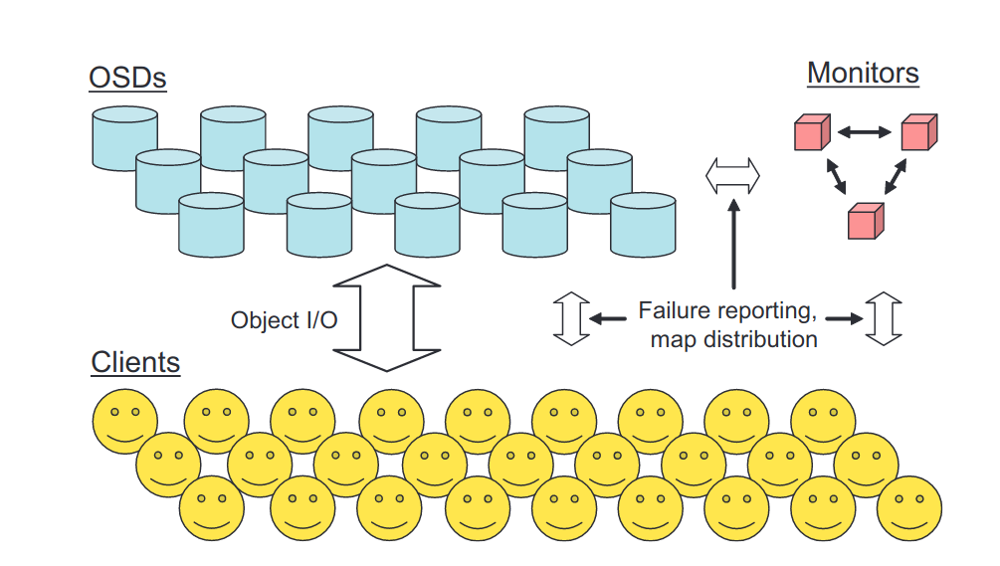

## 1. 简介

### 1.1 背景

高性能存储的要求较高（高吞吐量，低延时和对存储的抽象）块和对象存储被用作提高存储系统可扩展性的方式，但现有（论文当时）的系统将存储节点视作被动设备，而忽略了它们的自主性和智能性（存储节点是一个完整的计算机，有计算能力）。

（现有的）新兴存储架构通过促进客户端直接访问数据来简化布局并消除IO瓶颈，OSD（对象存储设备）将廉价机器的CPU、网络接口、缓存和底层硬盘结合，将基于块的存储接口替换为基于命名、可变长度对象的存储接口。但这种架构没有利用设备的智能：传统设备被动响应读取和写入命令。随着存储集群规模增大，数据分配、故障检测和恢复等给客户端、控制器、元数据目录节点带来越来越大的负担，限制了可扩展性。

而PB级规模上的存储系统必然是动态的：

- 它们是增量构建的
- 能够随新存储加入而扩充、随老设备退役而收缩
- 设备故障和恢复
- 大量数据创建和销毁

### 1.2 RADOS

论文提出了[RADOS](https://ceph.com/assets/pdfs/weil-rados-pdsw07.pdf) : 一种可扩展的，自主的分布式对象存储（a Reliable、Autonomic Distributed Object Store）。

RADOS旨在利用设备的计算能力分散随着规模扩大带来的（控制节点的）负载，同时给应用程序提供单一逻辑对象存储的抽象。通过为存储节点提供系统中数据分布的完整信息，设备可以使用点对点协议进行半自主操作，以自我管理数据复制、一致且安全地处理更新、参与故障检测、响应设备故障和通过重新复制或迁移导致的数据分布变化。

论文的原型实现公开了一个对象接口，可以在其中读取或写入字节范围（类似文件）。数据对象以多种方式分布在多个OSD上来防止节点故障。但是RADOS的可扩展性不依赖于特定的对象接口或冗余策略。

## 2. 可扩展的集群管理

RADOS 系统由大量 OSD 集合和一小群负责管理 OSD 集群成员资格的监视器组成。每个 OSD 包括一个 CPU、一些易失性 RAM、一个网络接口和一个本地连接的磁盘驱动器或 RAID。监视器是独立的进程，需要少量的本地存储。

### 2.1 Cluster Map

存储集群的管理完全由监视器集群对**Cluster Map**的操作来进行。Map信息包含了集群内拥有哪些OSD，简洁地显示系统中所有数据在集群内设备的分布。每个存储节点以及这个集群的客户端都保存有这个Map的副本。由于Map保存了完整的数据分布，因此客户端能公开一个简单的接口，将整个集群视作一个单个逻辑对象存储。

每当发生使Cluster Map更改的事件（如OSD状态改变或其他影响数据布局的事件），Map的epoch就会递增。epoch相当于版本号，使得各个节点能对当前数据的分布达成一致。Map的更新是增量的，以减小频繁更新带来的开销。大多数情况下，更新只表明一个或多个OSD已失败或已恢复。多个更新可以放在一起来描述相差多个epoch的Map的差异。

### 2.2 数据放置（Data Palcement）

RADOS的数据分布策略是将其中对象伪随机地分配给设备。当新的存储加入时，现存数据的随即子部分迁移到新设备以恢复平衡。该策略比较稳健，使所有设备保持相似的负载。数据放置是一个两阶段过程：计算对象属于哪个PG，将PG分配到具体的存储设备上。不需要大型或繁琐的集中分配表。

系统存储的每个对象首先被映射到PG（_placement group_ ），然后以PG为单位被分布到不同的设备上。PG的计算公式：

$$
pgid=(r,hash(o)\&m)
$$

其中， \(r\) 是期望的副本数量，\(o\)是对象名称，\(\&\)是位与符号，\(m=2^k-1\)是掩码。\(m\)将PG的数量限制为\(2^k-1\)，需要定期改变\(m\)来调整PG的总数，这步需要逐步完成，以限制PG在设备间的迁移。

PG基于**Cluster Map**分配给OSD。**Cluster Map** 将PG与OSD的有序列表对应，PG的副本就存储在有序列表对应的OSD上。副本与OSD的对应上，RADOS采用的是**CRUSH** 算法：CRUSH的行为类似于哈希函数，将每个PG的副本伪随机分配到固定的位置；但是CRUSH是稳定的，当有设备加入或离开集群时，大多数PG的位置不会改变；CRUSH只转移足够的数据以维持平衡分布。（CRUSH将在后面的文章介绍）
